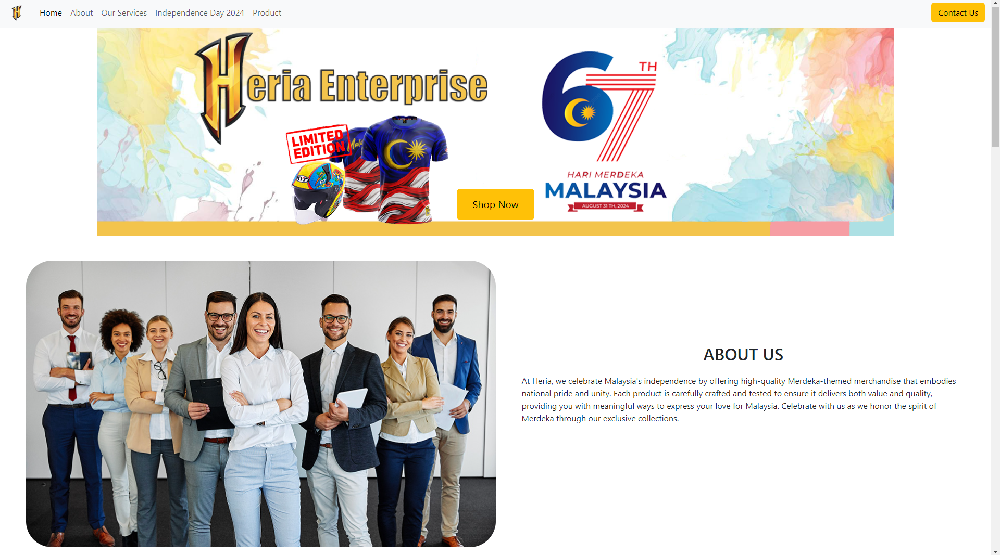
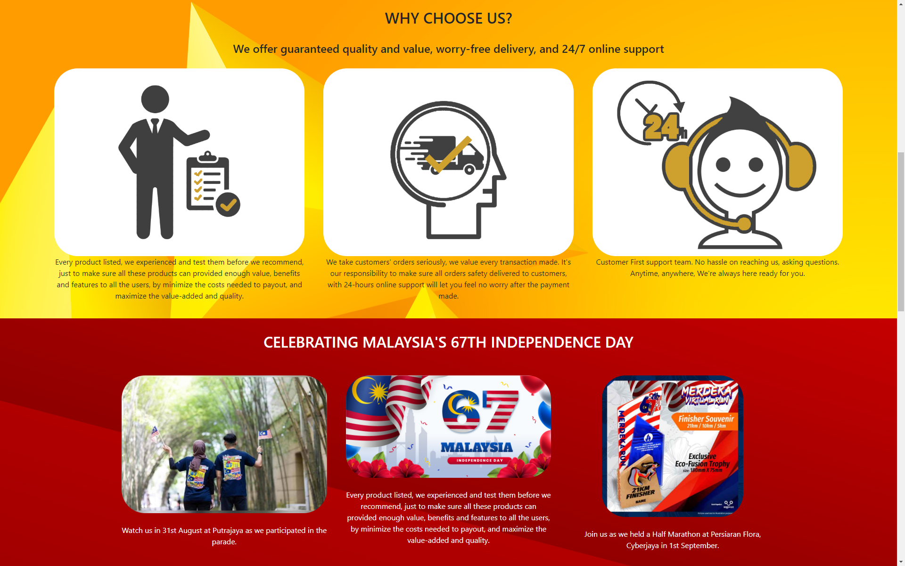
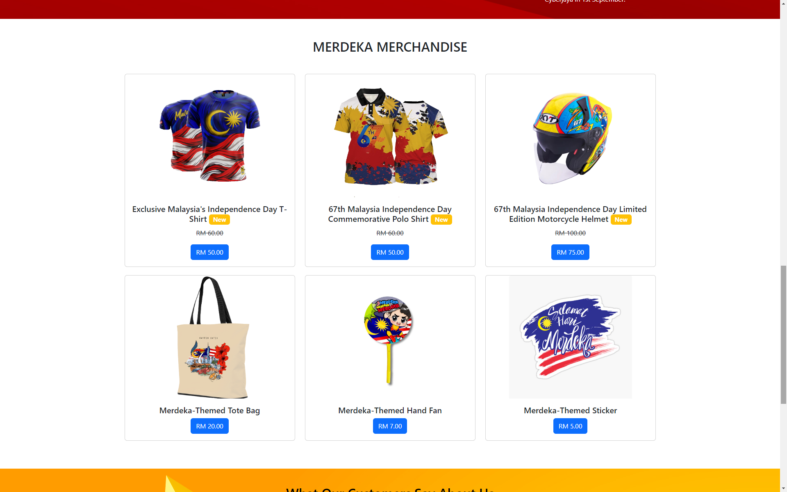
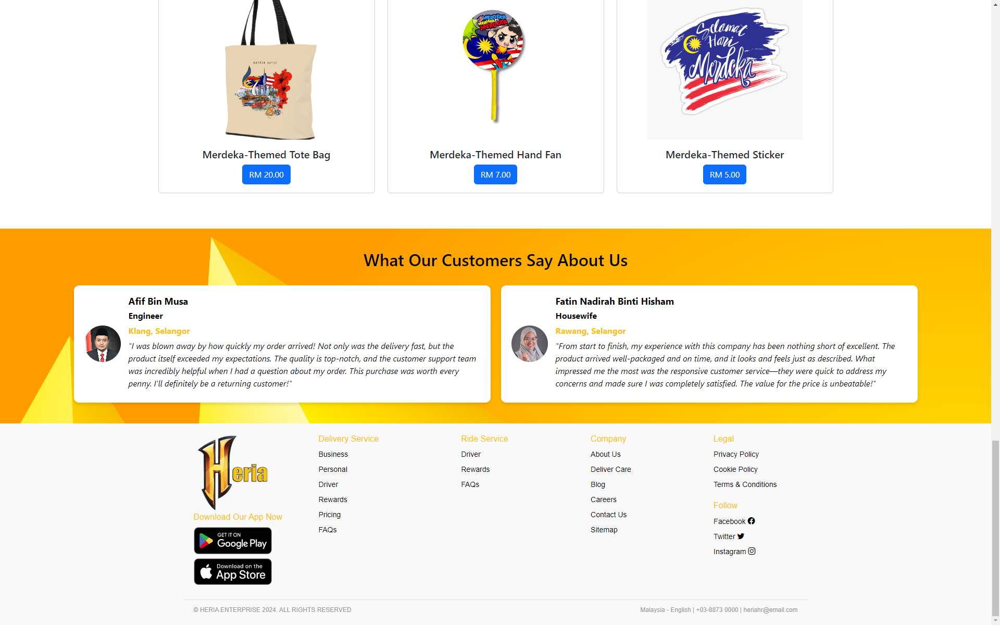
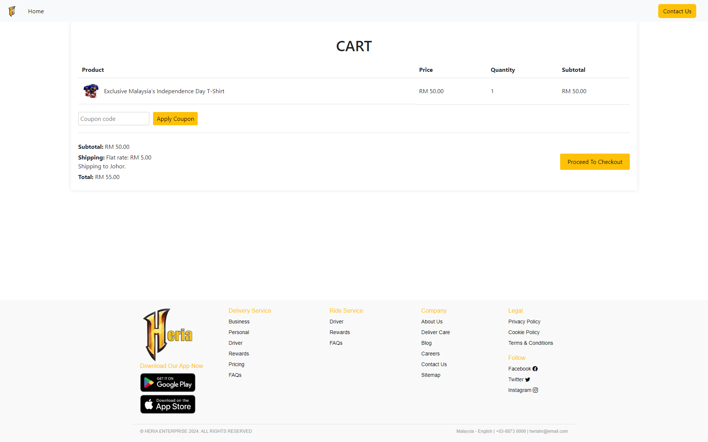
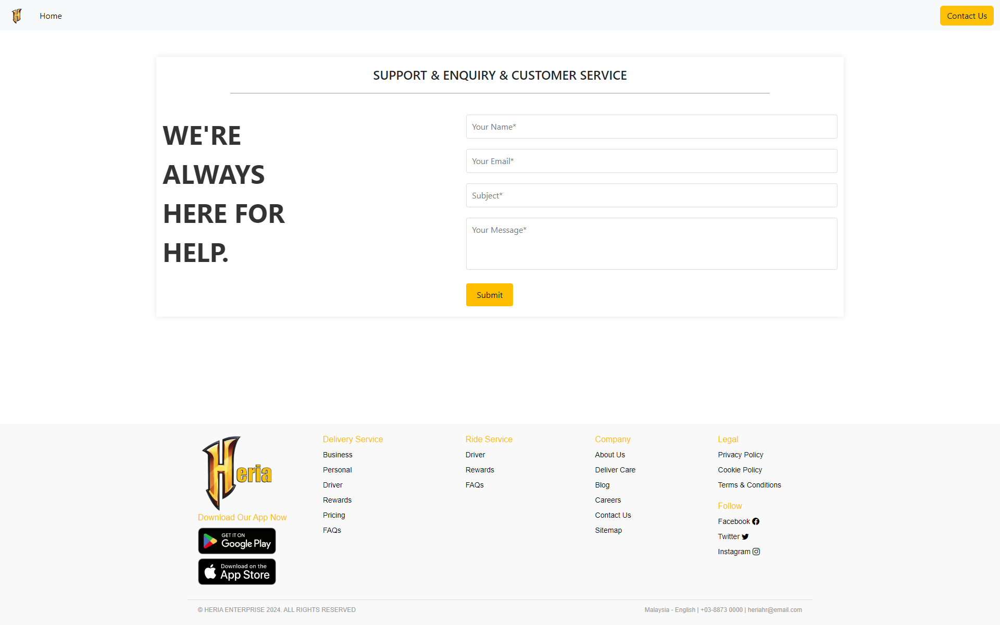

# This is part of Krenovator Merdeka Competition

Note: This project does not utilize Java; it is solely focused on demonstrating the design of a corporate website for Merdeka-themed merchandise.

Click the link to view the website: https://kimialias.github.io/heria_corporate-website-for-merdeka-merchandies-competition/

## Welcome Judges

Thank you for taking the time to review my project. I’m excited to showcase my work and share my journey in web development through this entry. Your feedback is invaluable to me, and I hope this project demonstrates both my current capabilities and my potential for growth in the field of web development.

## Project Overview

At Heria, we take pride in celebrating Malaysia's independence by offering premium Merdeka-themed merchandise that embodies our nation's pride and unity. Each item in our collection is meticulously crafted and rigorously tested to ensure it delivers both quality and value, providing you with meaningful ways to express your love for Malaysia. Join us in honoring the spirit of Merdeka through our exclusive collections.

This webpage is semi-responsive, incorporating various Bootstrap elements to enhance its design and functionality. I am pleased with the overall outcome of the website, especially considering this is only my second project at building a site with HTML and CSS (the first project was unfinished).

As I continue to develop my skills, I look forward to challenging myself by integrating JavaScript functions into future versions of this site. While front-end development is still a new and challenging area for me, I have always found back-end development more enjoyable.

## User Interface

Here are the UI screenshots for your review.

### Navigation Bar and About Us section

### Our Services and Merdeka Info Section

### Merdeka Merchandise

### Customer Comments and Footer

### Checkout

### Contact Us

